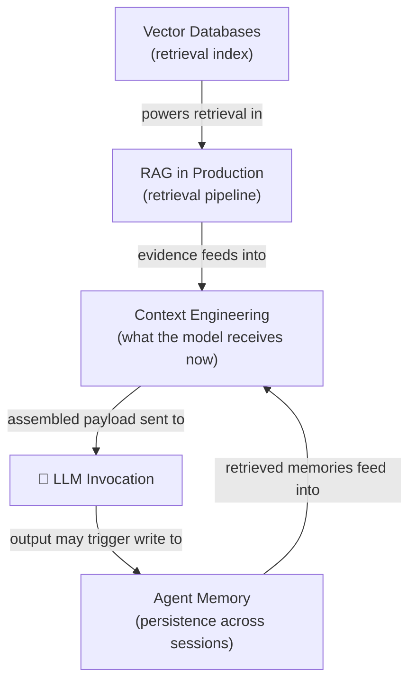

# AI Engineering

> Personal field notes on production AI systems. Each topic has a focused index and a single deep-dive blog. Depth over breadth — internals, algorithms, trade-offs, production reality.

---

## Topics

| Topic | What it studies | Status |
|-------|----------------|--------|
| [Vector Databases](vector-databases/00-INDEX.md) | Embedding geometry · ANN indexes (HNSW, IVF-PQ, DiskANN) · compression · storage internals · query processing · distributed architecture · system comparison · production ops | Active |
| [Context Engineering](context-engineering/00-INDEX.md) | Context construction, budgeting, ordering, compression, retrieval-as-selection, security — CM-00 through CM-06 complete | Active |
| [Agent Memory](agent-memory/00-INDEX.md) | Memory taxonomy, lifecycle, retrieval, real systems (Mem0, Letta, Zep), evaluation, security | Active |
| [RAG in Production](rag-in-production/00-INDEX.md) | 12-category failure taxonomy, CITE-RAG architecture, hybrid search, sufficiency check, observability, production checklist | Active |

---

## How the Topics Relate

```mermaid
flowchart TD
  VDB["Vector Databases\n(retrieval index)"]
  CTX["Context Engineering\n(what the model receives now)"]
  MEM["Agent Memory\n(persistence across sessions)"]
  RAG["RAG in Production\n(retrieval pipeline)"]

  VDB -->|"powers retrieval in"| RAG
  RAG -->|"evidence feeds into"| CTX
  MEM -->|"retrieved memories feed into"| CTX
  CTX -->|"assembled payload sent to"| LLM["🤖 LLM Invocation"]
  LLM -->|"output may trigger write to"| MEM
```

**Boundaries that matter:**
- Context management ≠ agent memory (different engineering problems)
- Retrieval is an *input source* to context assembly — not the same as context management
- A stored memory is *not* automatically in context — retrieval + injection required

---

*Last updated: 2026-11-11*
