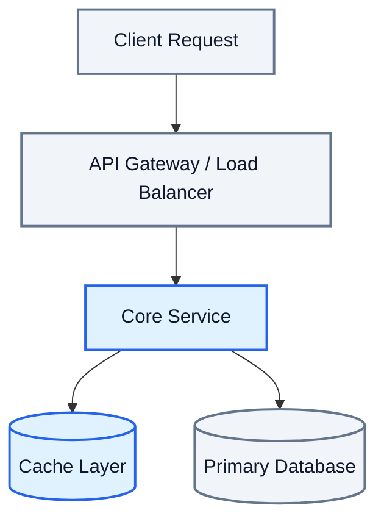

# Deep Dive: [Title of System / Concept]

*Author: Sajjarao Pavan Krishna | Date: YYYY-MM-DD | Category: [AI Engineering / System Design / DevOps]*

---

### 1. Problem Statement & Constraints
- **Context**: What problem are we addressing?
- **Scale Requirements**:
  - Throughput (QPS / Requests per second)
  - Latency SLA (p50, p99)
  - Data Volume & Storage Requirements
  - Consistency vs. Availability tradeoffs (CAP theorem context)

---

### 2. High-Level Architecture

---

### 3. Component Deep Dive & Data Flow
- **Step 1**: Detailed explanation of request handling.
- **Step 2**: Storage mechanics, caching logic, and state management.
- **Step 3**: Data structures used (e.g. Inverted Index, Ring Buffer, LSM Tree, B-Tree).

---

### 4. Trade-off Analysis (*Why X and not Y?*)

| Approach | Pros | Cons | Verdict |
|---|---|---|---|
| **Option A (Chosen)** | High throughput, partition tolerant | Eventual consistency | Ideal for our scale |
| **Option B** | Strong ACID guarantees | High latency under contention | Too slow for real-time reads |

---

### 5. Failure Modes & Edge Cases
- **Failure Scenario 1**: Cache stampede / Cache node failure.
  - *Mitigation*: Mutex locks, pre-computation, probabilistic early expiration.
- **Failure Scenario 2**: Network partition during write bursts.
  - *Mitigation*: Dead-letter queues, idempotent retry tokens.

---

### 6. Personal Takeaways & Production Blueprint
- *Key Lesson*: What would I do differently when building this from scratch?
- *Rule of Thumb*: When should you adopt this architecture vs. a simpler alternative?
